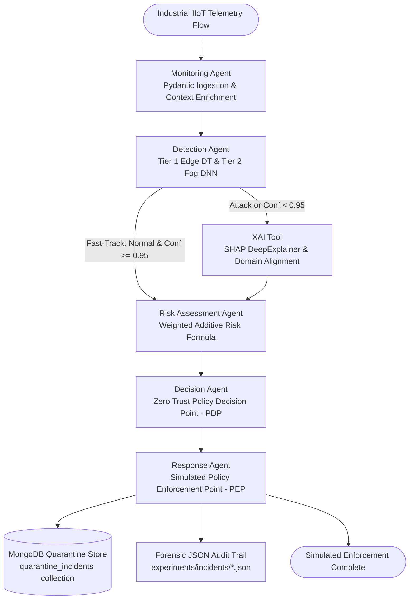

# A Self-Adaptive Zero Trust Cybersecurity Architecture for Industry 5.0 Enabled by Multi-Agent AI

[](https://www.python.org/)
[](https://pytorch.org/)
[](https://github.com/langchain-ai/langgraph)
[](https://docs.pydantic.dev/)
[](https://www.mongodb.com/)
[](#academic--research-disclaimer)

---

## 1. Project Overview

**Industry 5.0** marks the transition from purely automated manufacturing (Industry 4.0) to human-centric, resilient, and bio-inspired cyber-physical production systems. Industrial Internet of Things (IIoT) sensors, smart Programmable Logic Controllers (PLCs), robotic manipulators, and Human-Machine Interfaces (HMIs) now operate in shared physical workspaces alongside human operators.

Traditional perimeter firewalls and static signature-based Network Intrusion Detection Systems (NIDS) are inadequate for Industry 5.0. They fail to:
1. Detect stealthy multi-vector attacks (e.g., ARP poisoning, reconnaissance, ransomware) within distributed edge/fog topologies.
2. Adapt dynamically to cyber-physical risks (e.g., machinery velocity, human worker proximity).
3. Provide transparent, explainable decisions required for safety-critical manufacturing.

This project implements an autonomous, self-adaptive **Zero Trust Cybersecurity Architecture** uniting:
* **Two-Tier Hierarchical Detection:** Ultra-fast Tier 1 Edge binary triage with line-rate fast-tracking combined with deeper Tier 2 Fog Deep Learning for 15-class attack categorization.
* **Explainable AI (XAI):** Transparent feature attribution using SHAP (`DeepExplainer`) and LIME to justify Zero Trust policy decisions.
* **Autonomous Multi-Agent AI Orchestration:** Cyclical, deterministic state graphs built with **LangGraph** coordinating six specialized agents.
* **Mathematically Bounded Risk Formulation:** Continuous risk calculation strictly bounded to $[0, 100]$ evaluating threat severity, detection certainty, asset criticality, human worker distance, and XAI alignment.
* **Forensic Quarantine Store:** Immutable **MongoDB** persistence layer tracking quarantined entities, forensic metadata, and incident lifecycles.

---

## 2. Problem Statement

Modern industrial automation testbeds face severe cybersecurity challenges:
1. **Pervasive Interconnectivity:** The convergence of Information Technology (IT) and Operational Technology (OT) expands the attack surface to industrial protocols (Modbus, MQTT, HTTP, DNS, ARP).
2. **Extreme Class Imbalance & Skew:** Network telemetry exhibits massive imbalance (e.g., millions of benign flows alongside rare, severe exploits like MITM and Ransomware) and high positive skewness.
3. **Black-Box AI Risks:** High-capacity neural networks cannot be trusted blindly in safety-critical manufacturing cells where cyber incidents directly threaten human life.
4. **Latency Constraints:** Edge devices require sub-millisecond triage to preserve line-rate operations, while complex forensic analysis must be offloaded to fog/cloud servers.

---

## 3. Project Objectives

1. **Empirical Dataset Audit:** Profile and preprocess the realistic **Edge-IIoTset** benchmark dataset without data leakage.
2. **Edge-Level Lightweight ML:** Implement and validate an ultra-low-latency Decision Tree for binary triage ($< 0.1\ \mu\text{s}$ per flow).
3. **Fog-Level Deep Neural Network:** Construct and train a high-capacity PyTorch feed-forward neural network for 15-class attack identification.
4. **Explainable AI Justification:** Compute local and global Shapley attributions to decode neural network decision boundaries.
5. **Multi-Agent Orchestration:** Build a deterministic LangGraph state machine coordinating telemetry ingestion, threat detection, risk evaluation, Policy Decision Point (PDP) enforcement, and simulated mitigation.
6. **Zero Trust Policy Enforcement:** Implement a line-rate fast-track bypass for verified benign traffic and human-in-the-loop (HITL) escalation triggers for ambiguous threats.
7. **Forensic Persistence & Safety:** Establish an idempotent MongoDB quarantine store with advisory-only Emergency Stop (E-STOP) guarantees.

---

## 4. Proposed Architecture



---

## 5. System Workflow

The architecture follows a strict multi-stage lifecycle:

1. **Ingestion & Validation:** Incoming packets are validated against a 51-feature Pydantic contract and enriched with simulated cyber-physical context (asset criticality, human worker presence, worker distance).
2. **Tier 1 Edge Triage:** Flow is evaluated by the Edge Decision Tree:
   * **Fast-Track Line-Rate Bypass:** If predicted `Normal` with confidence $\ge 0.95$, Fog DL and XAI stages are bypassed, jumping straight to risk/decision with **1.75 ms** latency.
   * **Escalation:** If flagged as `Attack` or if benign confidence $< 0.95$, the flow is routed to Tier 2 Fog DNN.
3. **Tier 2 Fog Classification:** Evaluates 15 attack classes in PyTorch, yielding softmax probabilities.
4. **Explainable AI:** Computes local SHAP attributions against a $K=100$ training background distribution and evaluates domain alignment.
5. **Composite Risk Assessment:** Evaluates a mathematically bounded Zero Trust risk score $R \in [0.0, 100.0]$.
6. **Policy Decision Point (PDP):** Deterministic policy engine selects one of 7 actions (`ALLOW`, `MONITOR`, `RATE_LIMIT`, `QUARANTINE`, `QUARANTINE_AND_ESTOP_RECOMMENDATION`, `ESCALATE_TO_HUMAN_AMBIGUOUS`, `ESCALATE_TO_HUMAN_CRITICAL`).
7. **Policy Enforcement Point (PEP):** Generates syntactically valid iptables, eBPF (`bpftool`), or VLAN isolation strings (`SIMULATED_ENFORCEMENT_COMMAND:`).
8. **Quarantine Persistence:** Eligible containment incidents are persisted to MongoDB with unique incident indexes and status tracking.

---

## 6. Modules & Agents Actually Implemented

| Module / Component | Implementation Path | Current Status | Description |
| :--- | :--- | :---: | :--- |
| **Preprocessing Pipeline** | [`preprocessing/`](preprocessing/) | **COMPLETE** | Deduplication, median mDNS port anomaly imputation, RobustScaler, OneHotEncoder, 51-feature manifest. |
| **Edge Decision Tree** | [`models/edge_decision_tree.py`](models/edge_decision_tree.py) | **COMPLETE** | Lightweight scikit-learn Decision Tree wrapper (depth=11, 79 nodes, 8.6 KB). 99.77% accuracy, 0.047 $\mu$s latency. |
| **Fog Deep Neural Network** | [`models/fog_dnn.py`](models/fog_dnn.py) | **COMPLETE** | Configurable PyTorch feed-forward DNN (55,439 params, 220 KB). 15 attack classes, 95.11% accuracy, 0.9934 OvR ROC-AUC. |
| **XAI Tool** | [`agents/xai_tool.py`](agents/xai_tool.py) | **COMPLETE** | SHAP `DeepExplainer` on Fog DNN using training $K=100$ centroids. Local and global feature attribution. |
| **Monitoring Agent** | [`agents/monitoring_agent.py`](agents/monitoring_agent.py) | **COMPLETE** | Pydantic telemetry ingestion, schema validation, and cyber-physical context enrichment. |
| **Detection Agent** | [`agents/detection_agent.py`](agents/detection_agent.py) | **COMPLETE** | Two-tier hierarchical triage with fast-track threshold routing (`EDGE_BENIGN_CONFIDENCE_THRESHOLD = 0.95`). |
| **Risk Assessment Agent** | [`agents/risk_assessment_agent.py`](agents/risk_assessment_agent.py) | **COMPLETE** | Weighted additive risk formulation strictly bounded to $[0.0, 100.0]$ across 5 normalized dimensions. |
| **Decision Agent** | [`agents/decision_agent.py`](agents/decision_agent.py) | **COMPLETE** | Deterministic Zero Trust Policy Decision Point (PDP) and Human-in-the-Loop (HITL) triggers. |
| **Response Agent** | [`agents/response_agent.py`](agents/response_agent.py) | **COMPLETE** | Policy Enforcement Point (PEP) generating simulated firewall/eBPF commands and JSON logs. |
| **LangGraph Orchestrator** | [`agents/orchestrator.py`](agents/orchestrator.py) | **COMPLETE** | Compiled cyclical/conditional StateGraph connecting all nodes. |
| **MongoDB Quarantine Store** | [`storage/`](storage/) | **COMPLETE** | Pydantic data contract, lifecycle finite state machine, unique index enforcement, and PyMongo repository. |
| **Role-Based Access Control** | — | *Planned (Phase 8B)* | Cryptographic authorization and RBAC verification for SOC analysts. |
| **Streamlit SOC Dashboard** | [`dashboard/`](dashboard/) | *Planned (Phase 8C)* | Interactive web dashboard for real-time telemetry, XAI explanations, and quarantine controls. |
| **Self-Adaptive Learning** | — | *Planned (Phase 9)* | Continuous feedback loop and model adaptation based on human-verified incidents. |

---

## 7. Dataset Information

The project uses **Edge-IIoTset**, an authentic cybersecurity dataset generated by the IEEE:
* **Benchmark:** Edge-IIoTset: A New Comprehensive, Realistic Cyber Security Dataset of IoT and IIoT Applications (*IEEE Access*, 2022).
* **Raw Records:** 2,219,201 flows, 63 attributes (~1.13 GB).
* **Target Classes (15):** `Normal`, `DDoS_UDP`, `DDoS_ICMP`, `SQL_injection`, `DDoS_TCP`, `Vulnerability_scanner`, `Password`, `DDoS_HTTP`, `Port_Scanning`, `Uploading`, `Backdoor`, `XSS`, `Ransomware`, `Fingerprinting`, `MITM`.
* **Preprocessing Manifest:** Detailed instructions for raw data placement and split reproduction are provided in [`data/README.md`](data/README.md).
* **Clean Modeling Records:** 2,218,386 unique records (after removing 815 exact duplicates).

---

## 8. Data Preprocessing Pipeline

Implemented in [`preprocessing/`](preprocessing/) adhering strictly to the **Split-Before-Fit Zero Leakage Rule**:
1. **Deduplication:** Safely removes 815 duplicate rows.
2. **Stratified Split:** 70% Train (1,552,870 records), 15% Validation (332,758 records), 15% Test (332,758 records).
3. **mDNS Anomaly Handling:** Detects 367 corrupted hostname strings in `tcp.srcport` (e.g. `_googlecast._tcp.local` from MITM attacks) and imputes them via median imputation without artificial zero-forcing.
4. **Feature Selection:** Prunes 19 high-cardinality, temporal, or payload-leakage fields $\rightarrow$ exactly **51 clean features**.
5. **Scaling & Encoding:** Continuous features scaled using `RobustScaler`; categorical protocol indicators encoded via `OneHotEncoder`.
6. **Serialized Pipeline:** Saved to `models/preprocessor.joblib` (5.6 KB) for zero-skew inference.

---

## 9. Machine Learning Models Actually Implemented

### Tier 1: Edge Lightweight Decision Tree
* **File:** `models/edge_decision_tree.joblib` (8.6 KB)
* **Architecture:** CART Decision Tree (`max_depth=11`, 79 nodes, 40 leaves).
* **Performance:**
  * Test Accuracy: **99.77%**
  * Test F1-Score: **0.9986**
  * Inference Latency: **0.047 $\mu\text{s}$ / sample** (~21.08 million records/second).

### Tier 2: Fog Deep Neural Network (PyTorch)
* **File:** `models/fog_dnn.pth` (220 KB, 55,439 parameters)
* **Architecture:** Input (51) $\rightarrow$ Dense(256) $\rightarrow$ ReLU $\rightarrow$ Dropout(0.2) $\rightarrow$ Dense(128) $\rightarrow$ ReLU $\rightarrow$ Dropout(0.2) $\rightarrow$ Dense(64) $\rightarrow$ ReLU $\rightarrow$ Dropout(0.2) $\rightarrow$ Output(15).
* **Performance:**
  * Test Accuracy: **95.11%**
  * Macro F1-Score: **0.7852** (Weighted F1: 0.9507)
  * Multi-Class One-vs-Rest ROC-AUC: **0.9934**
  * Inference Latency: **0.22 ms / sample**.

---

## 10. Explainable AI (XAI) Implementation

Implemented in [`experiments/run_xai.py`](experiments/run_xai.py) and integrated into [`agents/xai_tool.py`](agents/xai_tool.py):
* **Explainer:** SHAP `DeepExplainer` based on DeepLIFT Shapley value propagation.
* **Background Reference:** $K=100$ centroids derived **strictly from the training partition** via $K$-means (`models/xai_background.npy`, 20 KB).
* **Additivity Verification:** Verified across 450 evaluation samples and 15 classes with mean absolute discrepancy of **0.118970** ($< 0.15\%$ relative error).
* **Top Explanatory Features:** `arp.opcode`, `arp.hw.size`, `icmp.checksum`, `icmp.transmit_timestamp`, `tcp.dstport`, `tcp.srcport`, `http.content_length`.

---

## 11. Multi-Agent AI Orchestration (LangGraph)

Orchestrated using a compiled LangGraph `StateGraph` ([`agents/orchestrator.py`](agents/orchestrator.py)):
* **Typed Data Contracts:** Powered by Pydantic models in [`agents/state.py`](agents/state.py).
* **Fast-Track Policy:** Evaluates `EDGE_BENIGN_CONFIDENCE_THRESHOLD = 0.95`. Normal traffic with high confidence skips Fog and XAI, delivering **1.75 ms** line-rate latency.
* **Deterministic PDP:** Pure Python policy decision engine without LLM in the loop.

---

## 12. Zero Trust Implementation & Risk Formulation

### Mathematically Bounded Composite Risk Formula
Implemented in [`agents/risk_assessment_agent.py`](agents/risk_assessment_agent.py):
$$R = 100.0 \times \Big( 0.35 \cdot S + 0.20 \cdot C + 0.20 \cdot A + 0.15 \cdot H + 0.10 \cdot X \Big)$$
* $S$: Normalized threat severity ($0.0$ for Normal, up to $0.95$ for MITM/Ransomware).
* $C$: Detection confidence ($1.0 - conf$ for normal traffic; $conf$ for attacks).
* $A$: Asset criticality normalized from $[1, 5]$ to $[0.0, 1.0]$.
* $H$: Human worker proximity normalized from distance $d$ (meters): $\max\left(0, \min\left(1, \frac{10-d}{10}\right)\right)$.
* $X$: XAI domain alignment score in $[0.0, 1.0]$.
* **Guarantees:** Bounded strictly to $[0.0, 100.0]$; weights sum to exactly $1.00$.

### Policy Decision Point Actions
1. `ALLOW`: Fast-track normal traffic ($R < 20.0$).
2. `MONITOR`: Low-severity reconnaissance ($20.0 \le R < 45.0$).
3. `RATE_LIMIT`: Moderate threat volume ($45.0 \le R < 65.0$).
4. `QUARANTINE`: High-confidence attack on critical asset ($R \ge 65.0$).
5. `QUARANTINE_AND_ESTOP_RECOMMENDATION`: High-severity attack on critical asset near human worker ($R \ge 70.0$, $dist \le 2.5$m).
6. `ESCALATE_TO_HUMAN_AMBIGUOUS`: Low model certainty ($conf < 0.70$) with elevated risk ($R \ge 40.0$).
7. `ESCALATE_TO_HUMAN_CRITICAL`: Ambiguous threat near human worker.

---

## 13. MongoDB Quarantine Store

Implemented in [`storage/`](storage/):
* **Data Contract:** [`QuarantineIncident`](storage/schemas.py) preserving 22 genuine forensic fields.
* **Idempotency:** Unique index on `incident_id` prevents duplicate insertions.
* **Lifecycle State Machine:** Strictly validates transitions:
  $$\text{DETECTED} \longrightarrow \text{RISK\_ASSESSED} \longrightarrow \text{QUARANTINED} \longleftrightarrow \text{PENDING\_REVIEW} \longrightarrow \text{RELEASED} \text{ or } \text{KEEP\_QUARANTINED}$$
* **Audit Trail:** Append-only `status_history` logging each transition, analyst comment, and timestamp.
* **Zero Secret Leakage:** Dynamic environment configuration with automatic credential masking (`://****:****@`).

---

## 14. Technologies Used

* **Languages:** Python 3.12.3
* **Machine Learning & Deep Learning:** PyTorch 2.14.0, scikit-learn 1.4+, NumPy, Pandas
* **Multi-Agent Orchestration:** LangGraph 1.2.11, LangChain Core 1.6.3
* **Data Contracts & Validation:** Pydantic 2.13.5
* **Explainable AI (XAI):** SHAP 0.52.0, LIME 0.2.0
* **Storage & Serialization:** MongoDB 8.2.2, PyMongo 4.11.2, PyArrow 25.0.1, Joblib
* **Visualization:** Matplotlib, Seaborn

---

## 15. Repository Structure

```text
cybersecurity/
├── README.md                          <- Comprehensive project documentation (this file)
├── requirements.txt                   <- Pinned project dependencies
├── .gitignore                         <- Comprehensive exclusion rules for Python, ML, and data
├── data/
│   ├── README.md                      <- Dataset acquisition and preprocessing guide
│   ├── raw/
│   │   └── .gitkeep                   <- Location for DNN-EdgeIIoT-dataset.csv (gitignored)
│   └── processed/
│       ├── .gitkeep
│       ├── feature_manifest.json      <- Clean 51-feature metadata and mappings
│       └── test.parquet               <- Frozen evaluation partition (332,758 records, ~8.6 MB)
├── docs/
│   └── README.md                      <- Phase-by-phase technical documentation index
├── models/
│   ├── edge_decision_tree.py          <- Edge Decision Tree model class
│   ├── edge_decision_tree.joblib      <- Frozen Edge Decision Tree weights (8.6 KB)
│   ├── edge_model_metadata.json       <- Edge model hyperparameters and benchmarks
│   ├── fog_dnn.py                     <- PyTorch Fog DNN architecture
│   ├── fog_dnn.pth                    <- Frozen Fog DNN checkpoint (220 KB, 55,439 params)
│   ├── fog_model_metadata.json        <- Fog DNN architecture parameters and metrics
│   ├── fog_class_mapping.json         <- 15-class categorical mappings
│   ├── feature_names.json             <- Ordered list of 51 features
│   ├── preprocessor.joblib            <- Complete fitted pipeline (5.6 KB)
│   ├── scaler.joblib                  <- Fitted RobustScaler (1.1 KB)
│   ├── encoder.joblib                 <- Fitted OneHotEncoder (1.5 KB)
│   ├── imputer.joblib                 <- Fitted median imputer (1.7 KB)
│   ├── label_mapping.json             <- Binary and multi-class mappings
│   ├── preprocessor_metadata.json     <- Preprocessing execution metadata
│   ├── xai_background.npy             <- K=100 training background centroids (20 KB)
│   └── xai_metadata.json              <- XAI execution metadata and additivity audit
├── preprocessing/
│   ├── config.py                      <- Preprocessing constants and paths
│   ├── inspect_dataset.py             <- Dataset inspection and integrity verification
│   ├── preprocessor.py                <- EdgeIIoTPreprocessor pipeline class
│   ├── preprocess.py                  <- End-to-end reproducible preprocessing script
│   └── validate_phase3.py             <- Standalone 13-check preprocessing validation suite
├── agents/
│   ├── __init__.py                    <- Package exports
│   ├── state.py                       <- Pydantic data schemas, Enums, and AgentGraphState
│   ├── monitoring_agent.py            <- Telemetry ingestion and context enrichment
│   ├── detection_agent.py             <- Two-tier detection with fast-track line-rate routing
│   ├── xai_tool.py                    <- SHAP local attribution and domain alignment tool
│   ├── risk_assessment_agent.py       <- Mathematically bounded Zero Trust risk calculation
│   ├── decision_agent.py              <- Policy Decision Point (PDP) and HITL triggers
│   ├── response_agent.py              <- Policy Enforcement Point (PEP) and incident logger
│   └── orchestrator.py                <- Compiled LangGraph StateGraph pipeline
├── storage/
│   ├── __init__.py                    <- Storage package exports
│   ├── config.py                      <- Environment configuration & URI credential masking
│   ├── exceptions.py                  <- Storage exception hierarchy
│   ├── schemas.py                     <- QuarantineIncident model, IncidentStatus enum, FSM
│   ├── mongodb.py                     <- MongoDBManager client lifecycle and index builder
│   └── quarantine_store.py            <- MongoQuarantineStore and InMemoryQuarantineStore
├── experiments/
│   ├── eda.py                         <- Exploratory Data Analysis generator
│   ├── train_edge_model.py            <- Edge Decision Tree training pipeline
│   ├── validate_edge_model.py         <- Standalone 12-check Edge validation suite
│   ├── train_fog_model.py             <- Fog DNN PyTorch training pipeline
│   ├── validate_fog_model.py          <- Standalone 16-check Fog validation suite
│   ├── run_xai.py                     <- Global and local XAI attribution pipeline
│   ├── validate_xai.py                <- Standalone 16-check XAI validation suite
│   ├── run_multiagent_demo.py         <- 4-scenario Multi-Agent demonstration script
│   ├── validate_phase7.py             <- Standalone 16-check Phase 7 compliance suite
│   ├── run_phase8a_demo.py            <- MongoDB quarantine store demonstration script
│   ├── validate_phase8a.py            <- Standalone 18-check Phase 8A compliance suite
│   ├── phase7_demo_summary.csv        <- Empirical demonstration summary matrix
│   ├── dataset_audit.md               <- Phase 2 empirical audit report
│   ├── preprocessing_report.md        <- Phase 3 preprocessing report
│   ├── edge_model_report.md           <- Phase 4 Edge model report
│   ├── fog_model_report.md            <- Phase 5 Fog model report
│   ├── xai_report.md                  <- Phase 6 XAI report
│   ├── phase7_report.md               <- Phase 7 Multi-Agent report
│   ├── phase8a_report.md              <- Phase 8A MongoDB Quarantine report
│   ├── figures/                       <- EDA, ROC, training curve, and confusion matrix PNGs
│   ├── xai/                           <- Global/local SHAP and LIME attribution PNGs
│   └── incidents/                     <- Forensic incident JSON records
├── tests/
│   ├── __init__.py                    <- Tests package exports
│   ├── test_phase7_multiagent.py      <- Pytest runner for Phase 7 compliance suite
│   └── test_phase8a_quarantine.py     <- Pytest runner for Phase 8A compliance suite
├── dashboard/
│   └── .gitkeep                       <- Future Streamlit dashboard directory (Phase 8C)
└── security/
    └── .gitkeep                       <- Future Zero Trust RBAC policy directory (Phase 8B)
```

---

## 16. Installation & Setup Instructions

### Prerequisites
* **Python:** 3.12+ (tested on Python 3.12.3)
* **MongoDB:** Version 6.0+ (tested on MongoDB 8.2.2)
* **Operating System:** macOS (Apple Silicon / Intel) or Linux (Ubuntu 22.04+)

### Step-by-Step Setup
```bash
# 1. Clone the repository
git clone https://github.com/Sanskarspandey/cybersecurity.git
cd cybersecurity

# 2. Create and activate a Python virtual environment
python3.12 -m venv .venv
source .venv/bin/activate

# 3. Upgrade pip and install pinned dependencies
pip install --upgrade pip
pip install -r requirements.txt

# 4. (Optional) Configure MongoDB Environment Variables
# If running MongoDB on a custom port or remote instance:
export MONGODB_URI="mongodb://localhost:27017"
export MONGODB_DATABASE="industry5_zero_trust"
export MONGODB_QUARANTINE_COLLECTION="quarantine_incidents"
```

---

## 17. How to Run the Project

### A. Run Multi-Agent AI Orchestration Demonstration (Phase 7)
Executes 4 real scenarios through the compiled LangGraph pipeline using genuine test records:
```bash
python experiments/run_multiagent_demo.py
```
* **Scenario 1 (Normal):** Fast-tracked at Edge $\rightarrow$ `ALLOW` (15.78 ms).
* **Scenario 2 (Port Scanning):** Escalated to Fog $\rightarrow$ `MONITOR` (39.48 risk).
* **Scenario 3 (MITM near Worker):** Escalated to Fog & XAI $\rightarrow$ `QUARANTINE_AND_ESTOP_RECOMMENDATION` (92.96 risk).
* **Scenario 4 (Ambiguous Threat):** Low model certainty $\rightarrow$ `ESCALATE_TO_HUMAN_AMBIGUOUS` (72.71 risk).

### B. Run MongoDB Quarantine Store Demonstration (Phase 8A)
Demonstrates insertion, idempotency, forensic retrieval, and lifecycle status transition on MongoDB:
```bash
python experiments/run_phase8a_demo.py
```

### C. Run Full Compliance Verification Suites
```bash
# Run Phase 7 Standalone Compliance Suite (16/16 Checks)
python experiments/validate_phase7.py

# Run Phase 8A Standalone Compliance & Regression Suite (18/18 Checks)
python experiments/validate_phase8a.py

# Or run via pytest
pytest tests/
```

---

## 18. Current Implementation Status

* **Phase 1 (Setup & Environment):** COMPLETE & FROZEN
* **Phase 2 (EDA & Dataset Audit):** COMPLETE & FROZEN
* **Phase 3 (Preprocessing & Feature Engineering):** COMPLETE & FROZEN (13/13 Checks Passed)
* **Phase 4 (Edge Lightweight Decision Tree):** COMPLETE & FROZEN (12/12 Checks Passed)
* **Phase 5 (Fog Deep Neural Network):** COMPLETE & FROZEN (16/16 Checks Passed)
* **Phase 6 (Explainable AI - SHAP/LIME):** COMPLETE & FROZEN (16/16 Checks Passed)
* **Phase 7 (Multi-Agent AI LangGraph Orchestrator):** COMPLETE & FROZEN (16/16 Checks Passed)
* **Phase 8A (MongoDB Quarantine Store):** COMPLETE & FROZEN (18/18 Checks Passed)
* **Phase 8B (Role-Based Access Control):** Planned
* **Phase 8C (Streamlit SOC Dashboard):** Planned
* **Phase 9 (Self-Adaptive Feedback Retraining):** Planned

---

## 19. Team Members

* **Ishan Verma** (Reg. No: `23BAI1198`) — School of Computer Science and Engineering (SCOPE), VIT Chennai
* **Sanskar Pandey** (Reg. No: `23BAI1197`) — School of Computer Science and Engineering (SCOPE), VIT Chennai
* **Soham Sinha** (Reg. No: `23BAI1223`) — School of Computer Science and Engineering (SCOPE), VIT Chennai

---

## 20. Faculty Guide

* **Dr. Manjula V**  
  Associate Professor, School of Computer Science and Engineering (SCOPE)  
  Vellore Institute of Technology (VIT), Chennai Campus

---

## 21. Future Scope

1. **Phase 8B (RBAC & Identity Governance):** Cryptographic credential verification, token-based least privilege enforcement, and authenticated analyst overrides.
2. **Phase 8C (Interactive SOC Dashboard):** Real-time Streamlit operations dashboard visualizing live flows, risk heatmaps, SHAP waterfall plots, and quarantine controls.
3. **Phase 9 (Self-Adaptive Feedback Retraining):** Active learning pipeline incorporating human analyst corrections to retrain Fog DNN checkpoints incrementally.
4. **Hardware Testbed Deployment:** Packaging lightweight edge models into Docker/eBPF containers on Raspberry Pi / NVIDIA Jetson micro-controllers.

---

## 22. Academic & Research Disclaimer

This repository is developed as an academic capstone research project at **VIT Chennai**. All firewall, eBPF, network quarantine, and emergency stop (E-STOP) enforcement commands are **simulated strings** (`SIMULATED_ENFORCEMENT_COMMAND:`) designed for safe evaluation without modifying host network interfaces or operating machinery.
