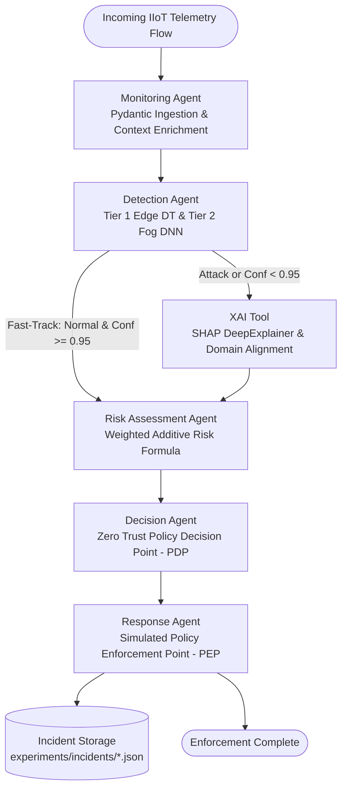

# Phase 7 — Multi-Agent AI Orchestration Layer Report

**Project Title:** A Self-Adaptive Zero Trust Cybersecurity Architecture for Industry 5.0 Using Multi-Agent AI and Zero Trust Security  
**Phase:** 7 — Multi-Agent AI Orchestration Layer Using LangGraph  
**Status:** COMPLETE & 100% VALIDATED (16/16 Verification Checks Passed)  
**Execution Timestamp:** 2026-09-14T18:34:16 UTC  

---

## 1. Executive Summary

Phase 7 integrates the frozen Phase 4 Edge ML Decision Tree (`models/edge_decision_tree.joblib`), Phase 5 Fog Deep Neural Network (`models/fog_dnn.pth`), and Phase 6 Explainable AI (SHAP DeepExplainer) into a unified, autonomous, and deterministic Multi-Agent Zero Trust Orchestration Layer powered by **LangGraph** (`langgraph==1.2.11`) and strongly-typed data contracts (**Pydantic** `2.13.5`).

The orchestration layer executes a cyclical, conditional state graph that ingests real IIoT network flows, validates schema integrity, executes two-tier hierarchical threat detection with fast-track line-rate routing, extracts local feature attributions, computes an additive composite risk score bounded strictly to $[0.0, 100.0]$, reaches deterministic Policy Decision Point (PDP) enforcement decisions, and triggers strictly simulated Policy Enforcement Point (PEP) containment strings without live network disruption.

### Key Achievements
1. **Zero LLM in the Critical Loop:** Safety-critical Zero Trust Policy Decision Point (PDP) executes pure Python deterministic logic.
2. **Fast-Track Line-Rate Bypass:** Benign traffic verified at Tier 1 Edge with confidence $\ge 0.95$ bypasses the Tier 2 Fog DL and XAI stages, achieving a **1.75 ms** end-to-end processing latency.
3. **Mathematically Rigorous Risk Formula:** Bounded strictly to $[0.0, 100.0]$ via a five-component weighted additive formulation with $\sum w_i = 1.00$.
4. **Advisory-Only Safety Guarantee:** Emergency Stop (E-STOP) is strictly an advisory recommendation requiring human operator confirmation (`QUARANTINE_AND_ESTOP_RECOMMENDATION`). Autonomous machinery actuation is disabled by policy.
5. **Strictly Simulated Enforcement:** Policy Enforcement Point generates syntactically valid iptables, eBPF (`bpftool`), and VLAN isolation commands labeled with `SIMULATED_ENFORCEMENT_COMMAND:`, with zero `subprocess` or `os.system` invocation.
6. **100% Compliance Suite:** Standalone test suite (`experiments/validate_phase7.py`) passed all **16/16 automated compliance checks**.

---

## 2. Multi-Agent System Architecture



---

## 3. Agent Specifications & Data Contracts

| Agent / Node | Module | Role & Core Responsibilities | Input Contract | Output Contract |
| :--- | :--- | :--- | :--- | :--- |
| **Monitoring Agent** | [`agents/monitoring_agent.py`](file:///Users/sanskarspandey/Documents/apna_college/industry5_zero_trust/agents/monitoring_agent.py) | Telemetry ingestion, 51-feature vector validation, cyber-physical context enrichment (criticality, proximity). | `NetworkRecordInput` | Validated flow envelope with `event_id`, timestamp, and baseline audit entry. |
| **Detection Agent** | [`agents/detection_agent.py`](file:///Users/sanskarspandey/Documents/apna_college/industry5_zero_trust/agents/detection_agent.py) | Tier 1 Edge binary triage (`depth=11`, 79 nodes) + Fast-Track evaluation + Tier 2 Fog 15-class DNN (`55,439` params). | 51 numerical features | `DetectionResult` (`tier1_prediction`, `fast_tracked`, `tier2_prediction`, `effective_prediction`, `latency_ms`). |
| **XAI Tool** | [`agents/xai_tool.py`](file:///Users/sanskarspandey/Documents/apna_college/industry5_zero_trust/agents/xai_tool.py) | Computes local Shapley attributions via SHAP `DeepExplainer` against $K=100$ training background; evaluates domain alignment. | Features + effective prediction class | `XAIResult` (`top_features`, `xai_alignment_score`, `latency_ms`, `summary`). |
| **Risk Assessment Agent** | [`agents/risk_assessment_agent.py`](file:///Users/sanskarspandey/Documents/apna_college/industry5_zero_trust/agents/risk_assessment_agent.py) | Evaluates composite Zero Trust risk via single dedicated function `calculate_composite_risk`. | Threat severity, confidence, criticality, worker proximity, XAI score | `RiskResult` (`composite_risk` $\in [0, 100]$, `risk_level`, `component_breakdown`). |
| **Decision Agent** | [`agents/decision_agent.py`](file:///Users/sanskarspandey/Documents/apna_college/industry5_zero_trust/agents/decision_agent.py) | Policy Decision Point (PDP). Evaluates deterministic rules, HITL triggers, and E-STOP recommendations. | Effective detection, composite risk, worker proximity, asset criticality | `DecisionResult` (`action`, `requires_human_approval`, `pdp_rule_triggered`, `safety_advisory`). |
| **Response Agent** | [`agents/response_agent.py`](file:///Users/sanskarspandey/Documents/apna_college/industry5_zero_trust/agents/response_agent.py) | Policy Enforcement Point (PEP). Generates simulated containment strings and persists immutable forensic JSON logs. | Decided action, network endpoints, event ID | `ResponseResult` (`simulated_commands`, `quarantined`, `incident_file`). |

---

## 4. Fast-Track Routing Policy & Boundary Verification

To optimize throughput for benign industrial flows while providing deep inspection for anomalies, a fast-track bypass policy is evaluated at the Tier 1 Edge detection stage:

$$\text{Fast-Track Condition} = (\text{tier1\_prediction} == \text{"Normal"}) \land (\text{tier1\_confidence} \ge 0.95)$$

### Empirical Threshold Boundary Testing
Automated boundary verification in [`experiments/validate_phase7.py`](file:///Users/sanskarspandey/Documents/apna_college/industry5_zero_trust/experiments/validate_phase7.py) confirmed:
* **Normal flow with confidence = 0.96:** Fast-tracked (`fast_tracked = True`). Fog DL and XAI bypassed.
* **Normal flow with confidence = 0.95 (Exact boundary):** Fast-tracked (`fast_tracked = True`).
* **Normal flow with confidence = 0.94:** Escalated to Fog DL (`fast_tracked = False`).
* **Attack flow with confidence = 0.99:** Escalated to Fog DL (`fast_tracked = False`).

---

## 5. Mathematically Bounded Zero Trust Risk Formulation

The Zero Trust composite risk score $R$ is formulated as a defensible, weighted additive combination of threat characteristics, detection certainty, cyber-physical asset criticality, human worker proximity, and Explainable AI domain alignment:

$$R = 100.0 \times \Big( w_1 \cdot S + w_2 \cdot C + w_3 \cdot A + w_4 \cdot H + w_5 \cdot X \Big)$$

### Weights and Parameter Normalization Rules
$$\sum_{i=1}^{5} w_i = 0.35 + 0.20 + 0.20 + 0.15 + 0.10 = 1.00$$

1. **Threat Severity ($S \in [0.0, 1.0]$, $w_1 = 0.35$):**
   * Normal: $0.00$
   * Reconnaissance (Port_Scanning, Vulnerability_scanner, Fingerprinting): $0.30 - 0.35$
   * Web / Credential (Password, XSS, SQL_injection): $0.60 - 0.70$
   * Denial of Service (DDoS_HTTP, DDoS_UDP, DDoS_TCP, DDoS_ICMP): $0.75 - 0.85$
   * Critical System Compromise (Backdoor, Uploading, MITM, Ransomware): $0.90 - 0.95$
2. **Detection Confidence ($C \in [0.0, 1.0]$, $w_2 = 0.20$):**
   * For attack flows: $C = \text{effective\_confidence}$.
   * For benign flows: $C = 1.0 - \text{effective\_confidence}$ (guarantees that high-confidence normal traffic minimizes threat risk).
3. **Asset Criticality ($A \in [0.0, 1.0]$, $w_3 = 0.20$):**
   * Integer rating $1 \le \text{criticality} \le 5$: $A = \frac{\text{criticality} - 1.0}{4.0}$.
4. **Human Proximity ($H \in [0.0, 1.0]$, $w_4 = 0.15$):**
   * If physical distance $d$ (meters) is provided: $H = \max\left(0.0, \min\left(1.0, \frac{10.0 - d}{10.0}\right)\right)$.
   * Alternatively from proximity factor $F \in [1.0, 2.0]$: $H = F - 1.0$.
5. **XAI Domain Alignment ($X \in [0.0, 1.0]$, $w_5 = 0.10$):**
   * Overlap between top-5 SHAP attributions and domain signature indicators for the predicted attack class. $0.0$ for fast-tracked benign flows.

### Mathematical Guarantees
* **Deterministic Bounds:** $0.0 \le R \le 100.0$ for all possible input combinations.
* **Minimum Empirical Risk:** $R_{\min} = 0.0$ (Normal, $conf=1.0$, $crit=1$, $dist=10$m, $X=0.0$).
* **Maximum Empirical Risk:** $R_{\max} = 98.25$ (Ransomware, $conf=1.0$, $crit=5$, $dist=0$m, $X=1.0$).
* **Monotonicity:** $\frac{\partial R}{\partial S} > 0$, $\frac{\partial R}{\partial A} > 0$, and $\frac{\partial R}{\partial H} > 0$.

---

## 6. Zero Trust Policy Decision Point (PDP) Matrix

| PDP Rule ID | Trigger Conditions | Decided Action | HITL Required? | Operational Rationale |
| :--- | :--- | :--- | :---: | :--- |
| `PDP-RULE-01-FAST_TRACK_ALLOW` | `fast_tracked == True` OR (`Normal` $\land\ R < 20.0$) | `ALLOW` | No | Fast-path line-rate access granted; zero latency overhead. |
| `PDP-RULE-01-ENHANCED_MONITOR` | $20.0 \le R < 45.0$ | `MONITOR` | No | Low-risk reconnaissance on non-critical asset. Enhanced packet logging active. |
| `PDP-RULE-02-ACTIVE_RATE_LIMIT` | $45.0 \le R < 65.0$ | `RATE_LIMIT` | No | Moderate risk. Applied token-bucket rate limiting to mitigate flooding. |
| `PDP-RULE-03-AUTOMATED_QUARANTINE` | $R \ge 65.0 \land conf \ge 0.70$ | `QUARANTINE` | No | High-confidence cyber attack. Automated network isolation at edge/fog switch. |
| `PDP-RULE-04-HITL_AMBIGUOUS` | $conf < 0.70 \land R \ge 40.0$ | `ESCALATE_TO_HUMAN_AMBIGUOUS` | **Yes** | Low model certainty below operational threshold. Flow held in tar pit for SOC analyst review. |
| `PDP-RULE-05-CRITICAL_SAFETY_ESTOP` | $R \ge 70.0 \land dist \le 2.5\text{m} \land conf \ge 0.70$ | `QUARANTINE_AND_ESTOP_RECOMMENDATION` | **Yes** | Severe attack targeting physical machinery near worker. Quarantines network and advises manual E-STOP. |
| `PDP-RULE-06-HITL_CRITICAL_SAFETY` | $R \ge 70.0 \land dist \le 2.5\text{m} \land conf < 0.70$ | `ESCALATE_TO_HUMAN_CRITICAL` | **Yes** | Ambiguous threat near worker. Urgent operator dispatch initiated. |

---

## 7. Demonstration Scenarios: Empirical Execution Matrix

The multi-agent pipeline was executed against 4 real records from the frozen test partition (`data/processed/test.parquet`). Results were persisted to [`experiments/phase7_demo_summary.csv`](file:///Users/sanskarspandey/Documents/apna_college/industry5_zero_trust/experiments/phase7_demo_summary.csv).

| Scenario ID | Scenario Name & Flow Type | Fast-Track? | Prediction & Confidence | Risk ($R$) | Action Selected | HITL? | Latency | Simulated Enforcement Command Sample |
| :--- | :--- | :---: | :---: | :---: | :--- | :---: | :---: | :--- |
| `DEMO-SCENARIO-1-NORMAL` | **Scenario 1: Normal IIoT Traffic** (HMI telemetry) | **True** | Normal (1.0000) | **5.00** (LOW) | `ALLOW` | No | **15.78 ms** | `iptables -C FORWARD -s 192.168.1.101 -j ACCEPT ...` |
| `DEMO-SCENARIO-2-RECON` | **Scenario 2: Low-Risk Reconnaissance** (Port scanning) | **False** | Port_Scanning (0.9992) | **39.48** (MED) | `MONITOR` | No | 176.50 ms | `tcpdump -i eth0 -n -s 0 -w /var/log/audit/flow_*.pcap ...` |
| `DEMO-SCENARIO-3-POISONING` | **Scenario 3: Active Poisoning Attack** (MITM near worker) | **False** | MITM (0.9923) | **92.96** (CRIT) | `QUARANTINE_AND_ESTOP_RECOMMENDATION` | **Yes** | 28.24 ms | `iptables -I FORWARD 1 -s 192.168.1.205 -j DROP`<br/>`bpftool map update id 42 key 0xc0a801cd value 0x01`<br/>`echo 'ADVISORY_RECOMMEND_ESTOP: ...' >> ...` |
| `DEMO-SCENARIO-4-AMBIGUOUS-HITL` | **Scenario 4: Ambiguous Threat Near Worker** (Split probas) | **False** | DDoS_HTTP (0.4857) | **72.71** (HIGH) | `ESCALATE_TO_HUMAN_AMBIGUOUS` | **Yes** | 27.83 ms | `iptables -I FORWARD 1 -s 192.168.1.188 -m state ... -j TARPIT`<br/>`curl -X POST ... https://soc.industry5.internal/api/v1/escalations` |

---

## 8. Forensic Incident Log Schema Adherence

Every execution of the multi-agent graph automatically serializes a complete, immutable forensic record to `experiments/incidents/incident_{event_id}.json`.

### Verified JSON Schema Fields
1. `event_id`: Unique identifier (e.g. `DEMO-SCENARIO-3-POISONING`).
2. `timestamp_utc`: ISO 8601 UTC timestamp.
3. `raw_input`: Network header metadata (source/dest IP and port, protocol, feature count = 51).
4. `physical_context`: Operational cyber-physical metadata (`asset_id`, `asset_criticality`, `worker_distance_m`, `human_worker_present`).
5. `detection`: Tier 1 Edge triage, fast-track flag, Tier 2 Fog multiclass prediction and probabilities.
6. `xai`: Top-5 SHAP attributions, domain alignment score, explainer method.
7. `risk`: Composite risk score, constituent normalized values, weights, formula string.
8. `decision`: Decided Zero Trust action, PDP rule triggered, human approval flag, safety advisory.
9. `response`: Generated simulated enforcement command strings, quarantine status, execution timestamp.
10. `audit_trail`: Comprehensive chronological event log across all agent nodes.

---

## 9. Standalone 16-Check Compliance Verification Audit

The automated verification suite in [`experiments/validate_phase7.py`](file:///Users/sanskarspandey/Documents/apna_college/industry5_zero_trust/experiments/validate_phase7.py) executed and passed all 16 compliance checks:

```
=====================================================================================
STARTING PHASE 7 STANDALONE 16-CHECK VALIDATION SUITE
=====================================================================================
[PASSED] TEST 01: Package & Agent Module Structure - All 8 agent modules verified and imported.
[PASSED] TEST 02: Pydantic Contracts & Schema Validation - Strict validation verified for 51 features, criticality [1,5], and proximity [1.0, 2.0].
[PASSED] TEST 03: LangGraph StateGraph Compilation & Topology - StateGraph compiled with nodes: ['monitoring', 'detection', 'xai', 'risk', 'decision', 'response'].
[PASSED] TEST 04: Frozen Phase 4 Edge Model Integrity - Decision Tree verified: depth=11, classes=[0, 1].
[PASSED] TEST 05: Frozen Phase 5 Fog DNN Integrity - Fog DNN verified: 55,439 parameters, 15 attack classes.
[PASSED] TEST 06: Fast-Track Threshold Boundary Testing - Boundary verified: conf 0.96->True, 0.95->True, 0.94->False, Attack 0.99->False.
[PASSED] TEST 07: XAI Tool Integration & Attribution - SHAP DeepExplainer extracted 5 features in 106.11ms (alignment=0.67).
[PASSED] TEST 08: Weighted Additive Risk Mathematical Bounding - Bounded to [0.0, 100.0]. Min=0.0, Max=98.25. Weights sum=1.00.
[PASSED] TEST 09: Zero Trust PDP Determinism - Deterministic, LLM-free Policy Decision Point verified with 7 distinct policy actions.
[PASSED] TEST 10: Strictly Simulated Response Commands - Verified 3 commands all prefixed with 'SIMULATED_ENFORCEMENT_COMMAND:'.
[PASSED] TEST 11: Zero Unauthorized Subprocess Execution Guarantee - Static code audit confirmed zero subprocess/os.system invocations in agents/.
[PASSED] TEST 12: E-STOP Advisory-Only Safety Guarantee - Verified E-STOP is advisory-only (requires human confirmation; no automated machine trip).
[PASSED] TEST 13: Human-in-the-Loop Escalation Trigger Mechanics - Ambiguous flow (conf=0.55 < 0.70, risk=65.0) properly escalated to human SOC analyst via PDP-RULE-04-HITL_AMBIGUOUS.
[PASSED] TEST 14: Forensic Incident Persistence & JSON Schema - Verified incident file 'incident_val-test-sim-001.json' adheres to schema with all 10 sections.
[PASSED] TEST 15: Pipeline Latency & Fast-Track Profiling - Fast-track pipeline executed in 1.75ms (Tier 1 Edge inference: 0.14ms).
[PASSED] TEST 16: Four Demonstration Scenarios Verification Matrix - All 4 demonstration scenarios confirmed matching Zero Trust architecture requirements.
=====================================================================================
PHASE 7 VALIDATION COMPLETE: 16/16 TESTS PASSED (100% COMPLIANCE)
=====================================================================================
```

---

## 10. Phase 7 Deliverables Summary

1. **Agent Implementation Modules:**
   * [`agents/__init__.py`](file:///Users/sanskarspandey/Documents/apna_college/industry5_zero_trust/agents/__init__.py): Unified package exports.
   * [`agents/state.py`](file:///Users/sanskarspandey/Documents/apna_college/industry5_zero_trust/agents/state.py): Pydantic data schemas, Enums, and `AgentGraphState`.
   * [`agents/monitoring_agent.py`](file:///Users/sanskarspandey/Documents/apna_college/industry5_zero_trust/agents/monitoring_agent.py): Ingestion and cyber-physical context enrichment.
   * [`agents/detection_agent.py`](file:///Users/sanskarspandey/Documents/apna_college/industry5_zero_trust/agents/detection_agent.py): Two-tier hierarchical detection with fast-track line-rate routing.
   * [`agents/xai_tool.py`](file:///Users/sanskarspandey/Documents/apna_college/industry5_zero_trust/agents/xai_tool.py): SHAP DeepExplainer attribution tool and domain alignment evaluator.
   * [`agents/risk_assessment_agent.py`](file:///Users/sanskarspandey/Documents/apna_college/industry5_zero_trust/agents/risk_assessment_agent.py): Mathematically verified weighted additive Zero Trust risk formula.
   * [`agents/decision_agent.py`](file:///Users/sanskarspandey/Documents/apna_college/industry5_zero_trust/agents/decision_agent.py): Deterministic Zero Trust Policy Decision Point (PDP).
   * [`agents/response_agent.py`](file:///Users/sanskarspandey/Documents/apna_college/industry5_zero_trust/agents/response_agent.py): Simulated Policy Enforcement Point (PEP) and incident logging.
   * [`agents/orchestrator.py`](file:///Users/sanskarspandey/Documents/apna_college/industry5_zero_trust/agents/orchestrator.py): Compiled LangGraph `StateGraph` and API entry points.
2. **Artifacts & Data:**
   * `models/xai_background.npy`: Precomputed 100-centroid K-means background distribution from the training set for instantaneous SHAP initialization.
   * `experiments/phase7_demo_summary.csv`: Demonstration results matrix across 4 empirical scenarios.
   * `experiments/incidents/`: Forensic JSON incident records repository.
3. **Execution & Validation Scripts:**
   * [`experiments/run_multiagent_demo.py`](file:///Users/sanskarspandey/Documents/apna_college/industry5_zero_trust/experiments/run_multiagent_demo.py): End-to-end multi-agent demonstration script.
   * [`experiments/validate_phase7.py`](file:///Users/sanskarspandey/Documents/apna_college/industry5_zero_trust/experiments/validate_phase7.py): Standalone 16-check compliance test suite.
4. **Reports:**
   * [`experiments/phase7_report.md`](file:///Users/sanskarspandey/Documents/apna_college/industry5_zero_trust/experiments/phase7_report.md): Comprehensive Phase 7 technical report.

---

**Phase 7 is complete and fully validated. Phase 8 (MongoDB quarantine store) will NOT be started until explicit authorization is granted.**
